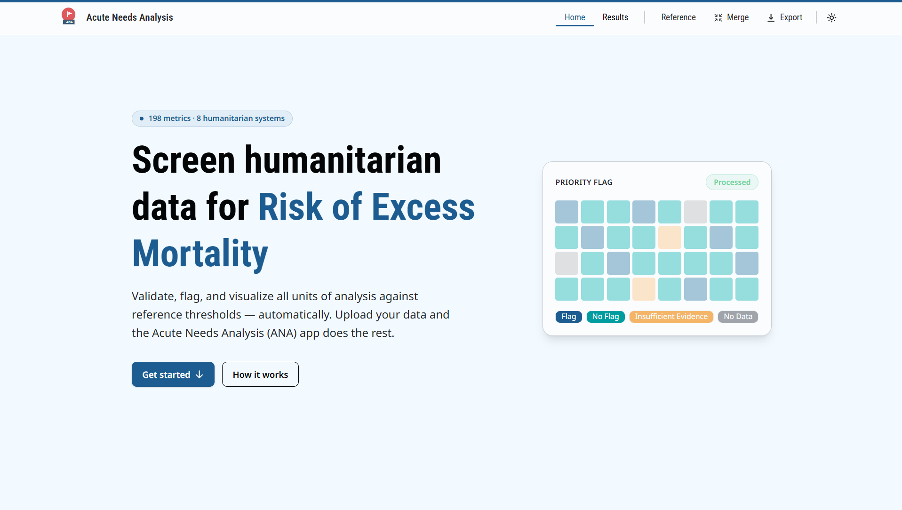

<div align="center">

# Acute Needs Analysis (ANA)

**Screen humanitarian data for risk of excess mortality — automatically.**

[](https://github.com/gnoblet/ANA_app_svelte/actions/workflows/deploy.yml)
[](https://gnoblet.github.io/ANA_app_svelte)
[](https://kit.svelte.dev)
[](https://tailwindcss.com)
[](https://bun.sh)



</div>

---

## Table of contents

1. [What ANA does](#what-ana-does)
2. [Getting started](#getting-started) — setup, dev server, all commands
3. [App views](#app-views)
4. [How it works](#how-it-works) — flagging pipeline, reference framework
5. [Data model](#data-model) — reference.json shape, flagged row shape
6. [Architecture](#architecture) — engine modules, stores, routes, components
7. [Tech stack](#tech-stack)
8. [Maintenance guide](#maintenance-guide--data-pipeline-and-export-logic)

---

## What ANA does

Upload a CSV (one row per unit of analysis, columns mainly metric IDs `MET001`, `MET002`, …). the app validates it, applies threshold-based flagging across 198 metrics and 8 humanitarian systems, and delivers two core outputs:

| Output                  | Description                                                                                                                                                                                                                             |
| ----------------------- | --------------------------------------------------------------------------------------------------------------------------------------------------------------------------------------------------------------------------------------- |
| **Priority flag**       | Each unit is screened and assigned one of 8 severity levels — from _Excess Mortality_ down to _No Acute Needs_                                                                                                                          |
| **Deep-dive workbooks** | A ZIP of per-unit XLSX files, pre-filled with metric values, flags, and AN/VAN thresholds. H1–H5 hypothesis and comment columns are left blank for analysts to complete. Optionally enriched with columns of metric sources (see below) |

Everything else in the app — heatmaps, choropleth map, coverage charts, spotlight cross-tab — is designed to help analysts interpret flagging results and decide which units warrant a deep dive.

### Optional: metric sources upload

Before running the pipeline, analysts can upload a second CSV that maps data sources to specific metrics and units of analysis. This annotates every metric row in the deep-dive workbooks with four extra columns: **Source**, **Source link**, **Start of data collection**, and **End of data collection**. The sources CSV is stored in `localStorage` and reapplied on subsequent visits until explicitly cleared.

**Priority flag severity order:**

`EM` · `HO – Primary` · `HO – Secondary` · `AN – Primary` · `AN – Secondary` · `Insufficient Evidence` · `No Data` · `No Acute Needs`

> The priority flag is a data-driven pre-screening result, not a conclusion. Each unit requires a full deep-dive before drawing final conclusions.

---

## Getting started

Requires [Podman](https://podman.io/) and [podman-compose](https://github.com/containers/podman-compose).
No other tools needed on the host. The container image runs Fedora 42.

```bash
sudo dnf install podman podman-compose   # Fedora / WSL Fedora
```

> **Windows / WSL 2** — install WSL 2 first (`wsl --install -d FedoraLinux-42`), then run all commands inside WSL.

### Start the dev server

```bash
podman-compose up
```

Open <http://localhost:5173>.

### Devcontainer (VS Code / Podman Desktop / GitHub Codespaces)

Open the repo in a devcontainer-aware editor. `bun install` runs automatically.
VS Code: set `"docker.dockerPath": "podman"` in your user settings.

### Commands

All `bun run` commands execute inside the container (`podman exec ana-dev bun run <cmd>` or via a devcontainer terminal).

```bash
# App
bun run dev           # start dev server at http://localhost:5173
bun run build         # production build (outputs to build/)
bun run preview       # preview the production build locally
bun run check         # Svelte type-checking (svelte-check)
bun run lint          # ESLint
bun run format        # Prettier
bun run test          # run the test suite (Vitest)

# Data pipeline
bun run generate:enums              # regenerate TS enums from reference CSV
bun run generate:reference-json     # regenerate reference.json + reference-circlepacking.json
bun run generate:input-data         # generate sample input data CSV
bun run generate:input-sources      # generate sample metric sources CSV
bun run validate:reference-json     # validate reference.json
bun run validate:hypotheses-json    # validate hypotheses JSON
bun run validate:circlepacking-json # validate reference-circlepacking.json
bun run data:refresh                # run all generation + validation in sequence
```

Set `BASE_PATH=/repo-name` when building for GitHub Pages sub-path deploys.

---

## App views

| Tab           | What you see                                                                                    |
| ------------- | ----------------------------------------------------------------------------------------------- |
| **Overview**  | Priority-flag donut chart, ranked UoA table, choropleth map with ADM1/ADM2/mixed boundary modes |
| **Systems**   | Flag-count heatmap across all systems; click any cell to open the metric drilldown              |
| **Spotlight** | Custom metric × UoA cross-tab with AN/VAN threshold badges and sticky column                    |
| **Metrics**   | Factor → subfactor → metric card grid per system; filterable by evidence type                   |
| **Coverage**  | Data availability bars per system; Health Outcomes tab with metric-level AN/VAN breakdown       |
| **Export**    | Download results as CSV, JSON, or XLSX; generate per-UoA deep-dive workbooks (ZIP)              |

---

## How it works

### Reference framework

The framework has five levels, from broadest to most specific:

```
System  →  Factor  →  Sub-Factor  →  Indicator  →  Metric
```

- A **Metric** is the leaf: one measurable value (e.g. "Acute malnutrition prevalence — MUAC"). It has a numeric threshold. If a field result crosses that threshold, the metric is flagged.
- An **Indicator** groups one or more metrics that measure the same concept from different angles.
- **Sub-Factor, Factor, and System** are progressively broader groupings. Flagging rolls upward: enough flagged metrics in a sub-factor flags the sub-factor, and so on up to system level.

### Data flow

```
CSV Upload  (src/routes/+page.svelte)
  → parser.ts          PapaParse wrapper — returns headers + raw rows
  → validator.ts       Checks headers against reference.json, UOA uniqueness, type constraints
  → flagger.ts         Applies thresholds; rolls up metric → subfactor → factor → system → priority_flag
  → fetchAdmin.ts      If p-codes detected, fetches ADM1/ADM2 GeoJSON from external API (fire-and-forget)
  → Stores             flagStore, adminFeaturesStore
  → Results routes     /results  (heatmap, drilldown, coverage, spotlight)
  → Export             download.ts (CSV/JSON/XLSX)  |  deepdive.ts (ZIP packages, one XLSX per UoA)
```

### The reference CSV — `static/data/reference.csv`

Each row is one metric. The columns that drive the app's behaviour:

| Column                                   | What it controls                                                                                                                                                                 |
| ---------------------------------------- | -------------------------------------------------------------------------------------------------------------------------------------------------------------------------------- |
| Metric ID                                | Unique code (e.g. `MET001`); must match the column header in the uploaded results CSV                                                                                            |
| System / Factor / Sub-Factor / Indicator | Placement in the hierarchy                                                                                                                                                       |
| Label                                    | Human-readable name shown in the dashboard                                                                                                                                       |
| Preference                               | Methodological robustness: 1 = strong evidence base, 2 = supplementary, 3 = reference-only (excluded from flagging pipeline entirely)                                            |
| Evidence type                            | `AN signal`, `Outcome`, `Predictor`, or `Supporting evidence`. `Supporting evidence` metrics receive metric-level flags but are **excluded from subfactor/factor/system rollup** |
| Type                                     | Accepted value format — e.g. `num[0:1]`, `int[0+]`. Values outside this range are flagged as invalid                                                                             |
| Threshold AN / VAN                       | Numeric cut-offs for Acute Needs and Very Acute Needs. Required for all non-supporting-evidence metrics                                                                          |
| Above or below                           | Whether a value above or below the threshold signals acute needs                                                                                                                 |
| Evidence threshold                       | Minimum metrics with data needed to reach a conclusion in a sub-factor group                                                                                                     |
| Factor threshold                         | Minimum flagged metrics needed to flag a sub-factor group                                                                                                                        |
| Usual data sources                       | Free-text field listing typical data sources for this metric — informational only, not used in the pipeline                                                                      |
| References for threshold                 | Citation or rationale for the AN/VAN threshold values — informational only                                                                                                       |

### How flagging works

#### Sub-factor rollup

Metrics are grouped within each sub-factor by their `(factor_threshold, evidence_threshold)` pair. Within each group:

- **Flag** if flagged metrics ≥ `factor_threshold`
- **No flag** if metrics with data ≥ `evidence_threshold` (and flag rule not met)
- **Insufficient evidence** if some data is present but below the evidence threshold
- **No data** if no metrics have data

Sub-factor → Factor → System statuses propagate upward: `flag` beats `no_flag` beats `insufficient_evidence` beats `no_data`. Only non-supporting-evidence metrics participate.

#### Priority flag decision tree

| Step | Condition                                                                                                                 | Flag                    |
| ---- | ------------------------------------------------------------------------------------------------------------------------- | ----------------------- |
| 0    | Mortality system flagged                                                                                                  | `em`                    |
| 1    | All classification systems have no data                                                                                   | `no_data`               |
| 2    | HO proportion rule: n > 5 and ≥ 2/3 HO metrics flagged, **or** 1 ≤ n ≤ 5 and ≥ 1/2 flagged                                | `ho_primary`            |
| 3    | Any HO metric crosses its VAN threshold (strict)                                                                          | `ho_secondary`          |
| 4    | Health outcomes flagged, **or** any classification metric crosses VAN (strict), **or** ≥ 3 classification systems flagged | `an_primary`            |
| 5    | Any classification system flagged                                                                                         | `an_secondary`          |
| 6    | No flags but some systems have no data or insufficient evidence                                                           | `insufficient_evidence` |
| 7    | All classification systems have data, nothing flagged                                                                     | `no_acute_needs`        |

**Classification systems:** Food Security, Health Outcomes, Livelihoods, WASH, Health/Nutrition Services (Mortality and Market Functionality have dedicated rules).

**VAN strict:** `van_is_strict: true` when the VAN threshold differs from AN. Metrics where VAN = AN are excluded from steps 3 and 4's VAN checks.

### What to do after updating the reference CSV

```bash
bun run data:refresh
```

This regenerates all JSON files the app reads from the CSV and validates them. Without this step, changes to the spreadsheet have no effect on the app.

---

## Data model

### `reference.json` shape

Generated from `reference.csv` by `scripts/generate-reference-json.ts`. The root is an array of systems:

```ts
ReferenceRoot = System[]

System  { id, label, factors: Factor[] }
Factor  { id, label, system, sub_factors: SubFactor[] }
SubFactor { id, label, factor, system, indicators: Indicator[] }
Indicator { id, label, sub_factor, factor, system, metrics: Metric[] }

Metric {
  metric: string           // "MET001"
  label: string
  preference: 1 | 2 | 3   // 3 = excluded from pipeline
  evidence_type: "AN signal" | "Outcome" | "Predictor" | "Supporting evidence"
  type: string             // e.g. "num[0:1]", "int[0+]"
  thresholds: { an: number | null; van: number | null }
  van_is_strict: boolean | null   // true when VAN ≠ AN and VAN is set
  above_or_below: "above" | "below"
  evidence_threshold: number
  factor_threshold: number
  indicator, sub_factor, factor, system  // parent IDs
}
```

### Flagged row shape

Each row output by the pipeline (`flagStore`) extends the original CSV row with computed columns:

```
uoa
MET001  MET001_flag  MET001_status  MET001_van_flag  MET001_van_status  MET001_within_10perc_change
...  (one block per metric)
subfactor_<subfactor_id>_<group_key>_status
factor_<factor_id>_status
system_<system_id>_status
priority_flag
```

**Status vocabulary** (applies at every rollup level):

| Value                   | Meaning                                |
| ----------------------- | -------------------------------------- |
| `flag`                  | Threshold crossed — acute needs signal |
| `no_flag`               | Sufficient evidence, nothing flagged   |
| `insufficient_evidence` | Some data but below evidence threshold |
| `no_data`               | No data at all for this level          |

`priority_flag` values (severity order): `em` · `ho_primary` · `ho_secondary` · `an_primary` · `an_secondary` · `insufficient_evidence` · `no_data` · `no_acute_needs`

---

## Architecture

### Engine — `src/lib/engine/`

| File                        | Role                                                                                                     |
| --------------------------- | -------------------------------------------------------------------------------------------------------- |
| `pipeline.ts`               | Orchestrates validate → flag → admin fetch (admin fetch fire-and-forget)                                 |
| `validator.ts`              | Validates CSV structure, metric presence, UoA uniqueness, type constraints                               |
| `flagger.ts`                | Threshold flagging with `@tidyjs/tidy`; sub-factor → factor → system → priority_flag rollup              |
| `metricMetadata.ts`         | Traverses `reference.json`; provides `getAllMetricIds()`, `buildSubfactorList()`, `buildReferenceRows()` |
| `fetchAdmin.ts`             | Detects p-codes in UoA column, fetches ADM1/ADM2 GeoJSON                                                 |
| `download.ts`               | Exports results as CSV / JSON / XLSX                                                                     |
| `deepdive.ts`               | Generates ZIP of per-UoA XLSX workbooks; reads system colours via `getComputedStyle`                     |
| `mergeDeepDives.ts`         | Merges analyst-completed deep-dive workbooks back into the app                                           |
| `exportMap.ts`              | Builds self-contained composite SVG (title, map, legend, logos) for map export                           |
| `parser.ts`                 | PapaParse wrapper; returns `{ headers, rows }`                                                           |
| `metricSourcesValidator.ts` | Parses, validates, and builds the metric→UoA sources map from the optional sources CSV                   |
| `referenceBuilder.ts`       | Constructs `reference.json` hierarchy at runtime from flat metric list                                   |
| `referenceMerger.ts`        | Merges custom reference rows into the base reference                                                     |

### Stores — `src/lib/stores/`

All stores use Svelte 5 `$state` runes and persist to `localStorage`.

| Store                | Key                        | Purpose                                                                                               |
| -------------------- | -------------------------- | ----------------------------------------------------------------------------------------------------- |
| `metricStore`        | `ana_metric_store_v2`      | Loads `reference.json`; exposes `referenceJson` (full tree) and `metricMap` (flat, keyed by `MET001`) |
| `flagStore`          | `ana_flag_store_v2`        | Stores `flaggedResult[]` rows from the pipeline                                                       |
| `adminFeaturesStore` | `ana_admin_features_store` | Cached GeoJSON admin boundaries; fetch state: `idle \| loading \| done \| error`                      |
| `resultsFilterStore` | `ana_results_filters_v1`   | Active filter selections (UoA, system, flag status)                                                   |
| `metricSourcesStore` | `ana_metric_sources_v1`    | Optional sources map (metric, UoA, source); hydrated from localStorage; cleared with all stores       |
| `validatorStore`     | —                          | Transient validation state; cleared after flagging completes                                          |
| `circlePackingStore` | —                          | Tree data for the circle-packing reference visualisation                                              |

### Routes

| Route        | Purpose                                                                                                |
| ------------ | ------------------------------------------------------------------------------------------------------ |
| `/`          | Home — CSV upload, step-by-step guidance, pipeline trigger                                             |
| `/results`   | Main results — heatmap, drilldown, coverage, spotlight, export                                         |
| `/reference` | Full metric framework (table + circle-packing visualisation)                                           |
| `/validate`  | Standalone CSV validator                                                                               |
| `/merge`     | Merge analyst-completed deep-dive workbooks; UoA detail modal on map/table click; outcome map download |

### Components

#### `src/lib/components/results/`

| Component                 | Purpose                                                       |
| ------------------------- | ------------------------------------------------------------- |
| `ResultsOverview.svelte`  | Overview tab — donut chart, UoA ranking table, choropleth map |
| `ResultsSystems.svelte`   | System heatmap overview; clicks open the metric drilldown     |
| `ResultsMetrics.svelte`   | Factor → subfactor → metric card grid per system              |
| `ResultsCoverage.svelte`  | Coverage summary across all systems                           |
| `ResultsSpotlight.svelte` | Custom metric × UoA cross-tab with AN/VAN threshold badges    |
| `ResultsExport.svelte`    | Export controls (CSV / JSON / XLSX / deep-dive ZIP)           |
| `FiltersSidebar.svelte`   | Filter panel (UoA, system, factor, status)                    |

#### `src/lib/components/viz/`

| Component                       | Purpose                                                     |
| ------------------------------- | ----------------------------------------------------------- |
| `HeatmapGrid.svelte`            | Systems × subfactors colour grid                            |
| `SystemMatrix.svelte`           | Expanded per-system metric matrix                           |
| `MetricDrilldown.svelte`        | Metric-level detail panel (value, status, threshold)        |
| `CirclePacking.svelte`          | Zoomable D3 circle-packing tree (5 depths: system → metric) |
| `CoverageDetailCards.svelte`    | Per-factor coverage bars                                    |
| `HealthOutcomesCoverage.svelte` | Health outcomes AN/VAN metric breakdown                     |
| `PriorityFlagDonut.svelte`      | Donut chart of priority-flag distribution                   |
| `UoaRankingTable.svelte`        | Ranked UoA table by priority flag                           |
| `UoaDetailPanel.svelte`         | Single-UoA detail view                                      |
| `UoaClusterPanel.svelte`        | Cluster view for UoA grouping                               |
| `ChoroplethMap.svelte`          | Choropleth map (p-codes + admin boundaries)                 |

#### `src/lib/components/ui/`

General-purpose primitives: `TooltipCard`, `LegendBadge`, `PriorityBadge`, `DataGuard`, `NavButton`, `ExploreNav`, and others.

**`DataGuard.svelte`** gates any page or section that requires store data — shows a loading/redirect state when `flagStore` or `metricStore` is not ready. Always wrap results pages with it.

### Colour system — `src/app.css`

Each system colour is defined as a single base hex in `:root`; five depth variants are derived automatically:

```css
--color-sys-food-system: #61d095;
--color-sys-food-system-d1: color-mix(in srgb, var(--color-sys-food-system) 10%, transparent);
--color-sys-food-system-d2: color-mix(in srgb, var(--color-sys-food-system) 40%, transparent);
/* … d3, d4, d5 */
```

`src/lib/utils/colors.ts` exports pure `var(--…)` strings. For non-browser contexts (ExcelJS in `deepdive.ts`), hex is read at runtime via `getComputedStyle`.

### Type system — `src/lib/types/`

| File                | What lives here                                                             |
| ------------------- | --------------------------------------------------------------------------- |
| `structure.ts`      | Priority-flag severity order, system/factor/subfactor ID enums              |
| `reference-json.ts` | Zod v4 schema + inferred TypeScript types for `reference.json`              |
| `generated/`        | Auto-generated enums from lookup CSVs — do not edit directly                |
| `steps.ts`          | Upload wizard step definitions                                              |
| `deepdives.ts`      | Deep-dive XLSX column definitions (`tableHeaders`, `colWidths`, `colCount`)                |
| `sources.ts`        | `MetricSourceRow`, `MetricSourceEntry`, `MetricSourcesMap` — optional metric sources types |

---

## Tech stack


| Library                        | Role                                                             |
| ------------------------------ | ---------------------------------------------------------------- |
| SvelteKit 2 + `adapter-static` | Framework; SPA fallback; deploys to GitHub Pages via `BASE_PATH` |
| Svelte 5                       | Runes-only (`$state`, `$derived`, `$effect`); no legacy stores   |
| Tailwind CSS 4                 | Utility classes configured via `@plugin` in `app.css`            |
| DaisyUI 5                      | Component classes; two themes: `ana-light`, `ana-dark`           |
| D3                             | Visualisation primitives: scales, geo, force, zoom, pack, axis   |
| SveltePlot                     | Chart components built on Observable Plot                        |
| @tidyjs/tidy                   | Data wrangling in `flagger.ts`                                   |
| Zod v4                         | Schema validation for `reference.json`                           |
| PapaParse                      | CSV parsing                                                      |
| Turf.js                        | Geospatial operations (buffer, dissolve, union, simplify)        |
| ExcelJS + fflate               | XLSX export and ZIP packaging                                    |
| Vitest                         | Test runner                                                      |

---

## Maintenance guide — data pipeline and export logic

### Repository map

| Directory / file                           | What lives here                                                                         |
| ------------------------------------------ | --------------------------------------------------------------------------------------- |
| `static/data/reference.csv`                | Metric-level source of truth — edit here, then run `data:refresh`                       |
| `static/data/system.csv`                   | Canonical list of valid system IDs + labels                                             |
| `static/data/factor.csv`                   | Canonical `(factor, system)` pairs                                                      |
| `static/data/subfactor.csv`                | Canonical `(sub_factor, factor, system)` triples                                        |
| `static/data/reference.json`               | Generated — do not edit directly                                                        |
| `static/data/reference-circlepacking.json` | Generated — do not edit directly                                                        |
| `scripts/`                                 | Generation and validation scripts (Bun, not bundled into the app)                       |
| `src/lib/engine/`                          | All data-processing logic: validation, flagging, export                                 |
| `src/lib/types/`                           | TypeScript interfaces and Zod schemas                                                   |
| `src/lib/stores/`                          | Runtime state (`metricStore` loads `reference.json`; `flagStore` holds pipeline output) |

### CSV → JSON generation

| Script                                   | Input                                            | Output                                            |
| ---------------------------------------- | ------------------------------------------------ | ------------------------------------------------- |
| `scripts/generate-reference-json.ts`     | `reference.csv`                                  | `reference.json` + `reference-circlepacking.json` |
| `scripts/validate-reference-json.ts`     | `reference.json` + `system/factor/subfactor.csv` | — (exits non-zero on error)                       |
| `scripts/validate-circlepacking-json.ts` | `reference-circlepacking.json`                   | —                                                 |
| `scripts/generate-system-enum.ts`        | `system.csv`                                     | `src/lib/types/generated/system-enum.ts`          |
| `scripts/generate-factor-enum.ts`        | `factor.csv`                                     | `src/lib/types/generated/factor-enum.ts`          |
| `scripts/generate-subfactor-enum.ts`     | `subfactor.csv`                                  | `src/lib/types/generated/subfactor-enum.ts`       |

Run everything: `bun run data:refresh`

**Adding a new metric:** add the row to `reference.csv`, run `data:refresh`, confirm no validation errors.

**Adding a new system/factor/subfactor:** update the relevant lookup CSV first, then add the rows to `reference.csv`, then run `data:refresh`.

**Renaming or removing a system/factor/subfactor ID:** update the lookup CSV and `reference.csv`, run `data:refresh` + `generate:enums`, then search the codebase for the old ID — it may appear in `src/lib/engine/flagger.ts`.

### CI/CD — `.github/workflows/deploy.yml`

- **Trigger:** push to `main`, or manually from the GitHub Actions tab
- **Build steps:** install Bun (via curl in Fedora 42 container) → `bun run data:refresh` → `bun run test` → `bun run build` → upload `build/` as Pages artifact
- **Key implication:** `data:refresh` runs in CI before the build — a CSV change that fails validation will break the deployment. Always run `bun run data:refresh` locally first.

### Flagging logic — `src/lib/engine/flagger.ts`

Entry point: `flagData(rows, referenceJson)`. Five stages:

1. **Metric level** (`makeMetricSpec`) — computes `{id}_flag`, `{id}_status`, `{id}_van_flag`, `{id}_van_status`, `{id}_within_10perc_change` for every non-preference-3 metric
2. **Sub-factor groups** — non-supporting-evidence metrics only, grouped by `(factor_threshold, evidence_threshold)` pair
3. **Sub-factor status** — worst outcome across all its threshold groups
4. **Factor / System rollup** — `rollupStatuses` aggregates child statuses
5. **`priority_flag`** — 8-step decision tree over system-level statuses and metric-level VAN flags

**Touch `flagger.ts` when:** the decision-tree logic changes, new priority-flag categories are added, or the rollup rules change. Threshold values live in the CSV.

### Deep-dive export — `src/lib/engine/deepdive.ts`

Generates a ZIP archive — one pre-populated `.xlsx` per Unit of Analysis. Each workbook has one worksheet per system. Each metric row carries:

- **Pre-populated:** Indicator label, Metric label, Metric ID, uploaded value, flag result, AN threshold, VAN threshold, direction
- **Source annotation (always present):** Source, Source link, Start of data collection, End of data collection — populated from the optional sources CSV if uploaded; otherwise left blank
- **Editable:** H1–H5 hypothesis columns, Comment field

XLSX filenames include the unit's priority flag: `deepdive_{uoa}_{priority_flag}.xlsx`.

Column definitions and table headers live in `src/lib/types/deepdives.ts` (`tableHeaders`, `colWidths`, `colCount`). Source column headers and widths are in `SOURCE_COL_HEADERS` / `SOURCE_COL_WIDTHS`.

**Touch `deepdive.ts` when:** export layout, cell styling, column order, or pre-population logic changes.
**Touch `deepdives.ts` when:** adding or removing columns from the exported table.
**Touch `metricSourcesValidator.ts` + `sources.ts` when:** the sources CSV format changes.

### Maintenance quick-reference

| Task                                        | Files to touch                                                                                                            |
| ------------------------------------------- | ------------------------------------------------------------------------------------------------------------------------- |
| Add / remove a metric                       | `reference.csv` → `bun run data:refresh`                                                                                  |
| Change flagging thresholds                  | `reference.csv` → `bun run data:refresh`                                                                                  |
| Add a new system                            | `system.csv` → `reference.csv` → `bun run data:refresh`                                                                   |
| Add a new factor                            | `factor.csv` → `reference.csv` → `bun run data:refresh`                                                                   |
| Add a new sub-factor                        | `subfactor.csv` → `reference.csv` → `bun run data:refresh`                                                                |
| Rename / remove a system, factor, subfactor | Update lookup CSV + `reference.csv` → `data:refresh` → `generate:enums` → search codebase for old ID                      |
| Change rollup or decision-tree logic        | `src/lib/engine/flagger.ts`                                                                                               |
| Change deep-dive XLSX layout or columns     | `src/lib/engine/deepdive.ts` + `src/lib/types/deepdives.ts` (+ `sources.ts` if touching source annotation columns)       |
| Add / edit hypotheses or non-system blocks  | `static/data/hypotheses.json` (schema in `src/lib/types/hypotheses.ts`) → `bun run validate:hypotheses-json`              |
| Add a new required CSV field                | `reference.csv` + `scripts/generate-reference-json.ts` + `src/lib/types/structure.ts` + `src/lib/types/reference-json.ts` |
